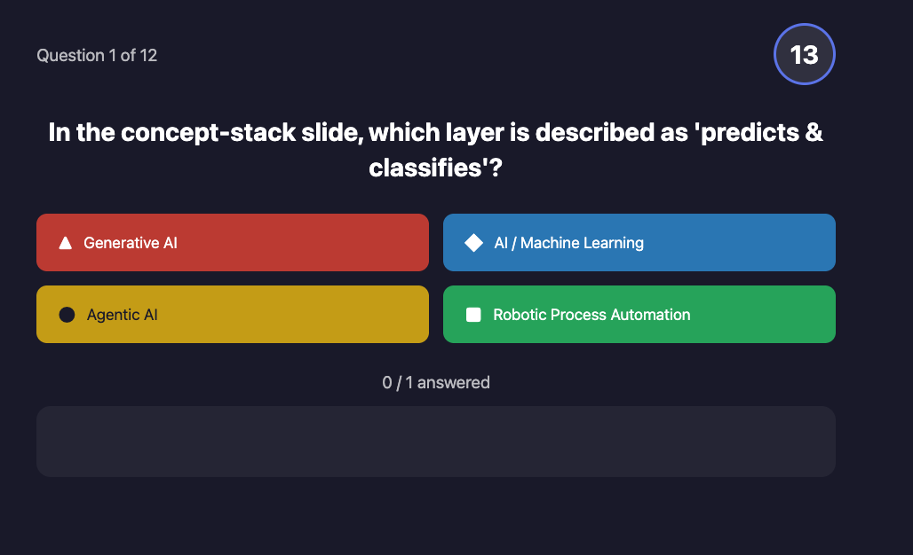
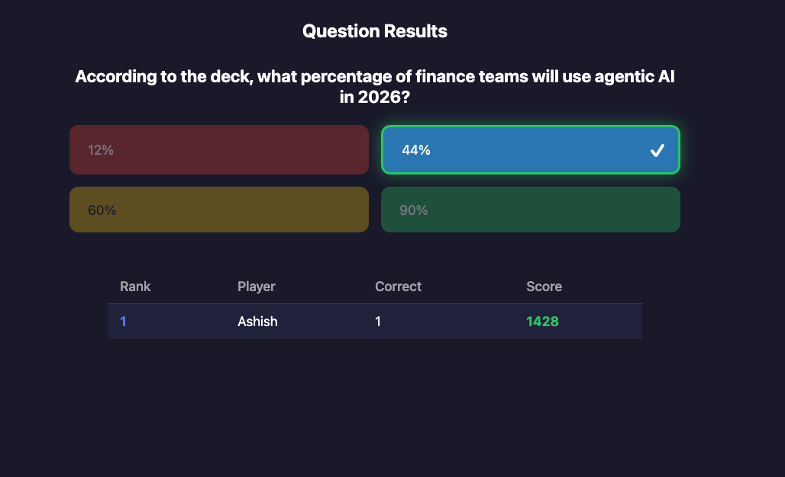
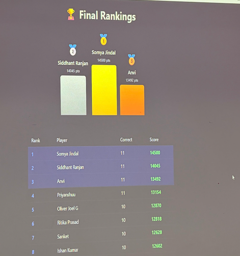

# Live Classroom Quiz

A real-time interactive quiz application built for classroom sessions. Students scan a QR code to join from their phones, answer timed questions, and compete on a live leaderboard — similar to Kahoot but free, custom-built, self-hosted on Render, and fully customizable.

Originally built for the **"AI, Generative AI & Agentic AI in Banking, Financial Services & Insurance"** session at MDI Gurgaon, and designed to be reused for any classroom or workshop by swapping in your own question batches.

## Screenshots

### 1. Quiz Selection
Select between multiple quiz batches (Batch A / Batch B).


### 2. QR Code Lobby
Students scan the QR code from their phones to join. Player names appear as they connect.


### 3. Live Question
Timed questions with color-coded options. Word cloud animates student names as they respond.



### 4. Answer Reveal & Rankings
Correct answer highlighted in green with live leaderboard after each question.



### 5. Final Podium
Top 3 on the podium with full rankings table — scored by correctness and speed.



## Features

- **QR Code Login** — Students scan a QR code on the projector to join instantly from their phones
- **Multiple Quiz Batches** — Host selects between Batch A and Batch B (or add more)
- **Real-time Word Cloud** — Student names animate in as they respond to each question
- **Speed-based Scoring** — 1000 base points + up to 500 bonus for answering quickly
- **Live Rankings** — Leaderboard updates after each question
- **Correct Answer Reveal** — Students see the right answer on their phones before moving on
- **Final Podium** — Top 3 displayed with gold/silver/bronze + full rankings table
- **Mobile-first Student UI** — Optimized for phone screens with large tap targets
- **Works Anywhere** — Runs locally or on any cloud platform (Render, Railway, Fly.io)

## Quick Start

```bash
# Install dependencies
npm install

# Start the server
npm start
```

Open `http://localhost:3000` on the projector — that's the host dashboard.
Students scan the QR code or visit the URL shown to join.

## How It Works

```
Host (Projector)                    Students (Phones)
─────────────────                   ──────────────────
1. Select quiz batch                
2. Show QR code          ──────►    Scan & enter name
3. Click "Start Quiz"              
4. Question + word cloud  ◄────►    Tap answer option
5. Click "Show Answer"   ──────►    See correct answer
6. Click "Next Question"           
7. (repeat 4-6)                    
8. Final rankings         ◄────►    See personal rank
```

## Project Structure

```
.
├── server.js                  # Node.js server (Express + WebSocket)
├── questions-batch-a.json     # Batch A questions (12 questions)
├── questions-batch-b.json     # Batch B questions (12 questions)
├── package.json
├── test-flow.js               # Automated test script (68 tests)
├── docs/
│   ├── TECHNICAL-FLOW.md      # Architecture, WebSocket protocol, API reference
│   └── USAGE-GUIDE.md         # Step-by-step usage instructions
└── public/
    ├── index.html             # Host dashboard
    ├── student.html           # Student mobile interface
    ├── styles.css             # All styling
    └── images/
        ├── mdi-logo.png       # MDI Gurgaon logo (from the original session)
        └── quiz-icon.svg      # Quiz bulb icon (favicon)
```

## Customizing Questions

Edit `questions-batch-a.json` or `questions-batch-b.json`:

```json
{
  "quizTitle": "Your Quiz Title",
  "timePerQuestion": 20,
  "questions": [
    {
      "id": 1,
      "question": "Your question here?",
      "options": ["Option A", "Option B", "Option C", "Option D"],
      "correctAnswer": 1,
      "timeLimit": 20
    }
  ]
}
```

- `correctAnswer` is 0-indexed (0=A, 1=B, 2=C, 3=D)
- `timeLimit` is seconds per question (overrides the default)

This is the main hook for reusing the app for a different class or topic — swap in new question batches without touching the app logic.

### Adding a New Batch

1. Create `questions-batch-c.json`
2. Add to `server.js`:
```javascript
const quizFiles = {
  'batch-a': { file: 'questions-batch-a.json', label: 'Batch A' },
  'batch-b': { file: 'questions-batch-b.json', label: 'Batch B' },
  'batch-c': { file: 'questions-batch-c.json', label: 'Batch C' },
};
```
3. Restart the server

## Scoring

| Condition | Points |
|-----------|--------|
| Wrong answer | 0 |
| Correct (at time limit) | 1000 |
| Correct (instant) | 1500 |
| Formula | `1000 + 500 × (1 - timeTaken/timeLimit)` |

Tiebreaker: lower total response time ranks higher.

## Deployment

The app works on any Node.js platform with WebSocket support:

| Platform | Free Tier | Notes |
|----------|-----------|-------|
| [Render](https://render.com) | 750 hrs/month | Auto-deploys from GitHub |
| [Railway](https://railway.app) | $5 credit/month | No cold starts |
| [Fly.io](https://fly.io) | 3 free VMs | Closest to a real server |

Set **Build Command** to `npm install` and **Start Command** to `npm start`.

The QR code automatically uses the correct public URL when deployed (reads from request headers).

## Running Tests

```bash
# Start the server first
npm start

# In another terminal
node test-flow.js
```

Runs 68 automated tests covering all flows: join, quiz selection, answering, scoring, rankings, reset, and error handling.

## Tech Stack

- **Backend:** Node.js, Express, ws (WebSocket)
- **Frontend:** Vanilla HTML/CSS/JS (zero client dependencies)
- **QR Code:** qrcode (server-side generation)
- **Real-time:** WebSocket for bidirectional host ↔ student communication

## License

MIT
